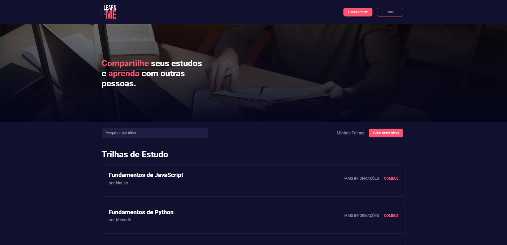

<p align="center" style="margin: 40px 0">
    
</p>

<div align="center">


</div>

# Learn with Me - App Front-end

Compartilhe seus estudos e aprenda com outras pessoas.

**Learn with Me** tem como objetivo conectar e ajudar pessoas a estudarem através do compartilhamento de conteúdos gratuitos na internet de forma estruturada e didática entre usuários. Venha estudar com a comunidade **Learn with Me** também! 😉

Projeto desenvolvido para o MVP na Sprint 1 da Pós Graduação de Engenharia de Software da PUC-Rio.

> ⚠️ Para o correto funcionamento dessa aplicação, é necessária sua conexão com a API. Você pode acessar o repositório da API desse projeto [clicando aqui](https://github.com/MicaelRiboura/learn-with-me-api). Também é necessário ter o Node.js instalado em sua máquina, [clique aqui para fazer o download](https://nodejs.org/pt-br/download).

## Pré-visualização

<p align="center" style="margin: 40px 0">
    
</p>

## Executando a Aplicação


### 1 - Clonando o repositório
Antes de tudo, precisamos clonar o projeto para ser executado em sua máquina. Você pode clonar esse repositório fazendo o download por meio de um arquivo ZIP ou através do seguinte comando:

```
git clone https://github.com/MicaelRiboura/learn-with-me-frontend.git
```

> ⚠️ Após clonar o repositório, é necessário ir ao diretório raiz do projeto, pelo terminal, para poder executar os comandos descritos abaixo.

#

Para executar a aplicação é necessário ter todas as libs (bibliotecas) JavaScript listadas no arquivo `package.json` instaladas. 

#

### 2 - Instalando as dependências

Para instalar as libs listadas no arquivo `package.json`, execute o comando abaixo:

```
npm install
```
### 3 - Executando a Aplicação
Finalmente, para executar a Aplicação Front-end, basta executar o seguinte comando:

```
npm start
```
